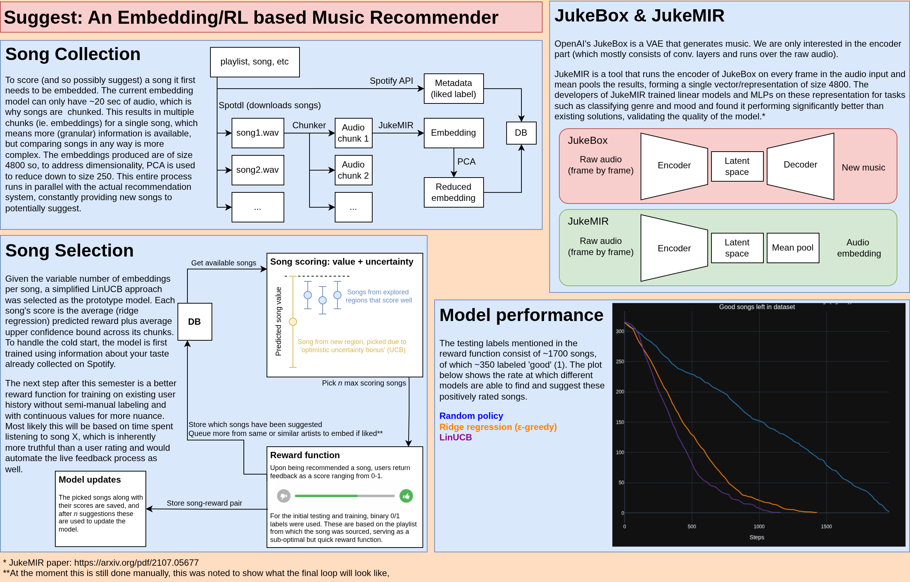

# Suggest: An Embedding and RL-Based Music Recommendation System

For any questions about the project, check out the extra notes PDF.

## File/Folder structure:
- **src/objects.py** contains the primitives set up to construct models and track metrics used for plotting;
- **src/plots.py** contains custom plotting tools;
- **src/reduce.py** contains PCA and UMAP related functionality;
- **src/data_visualizations.py** is a Marimo notebook with examples of custom plots in use.
- **src/quickstart.py** is a Marimo notebook containing a demo of the project;
- **src/metrics** contains metrics for general use and linear-specific models;
- **src/models** contains the suggestion models defined for the project.

