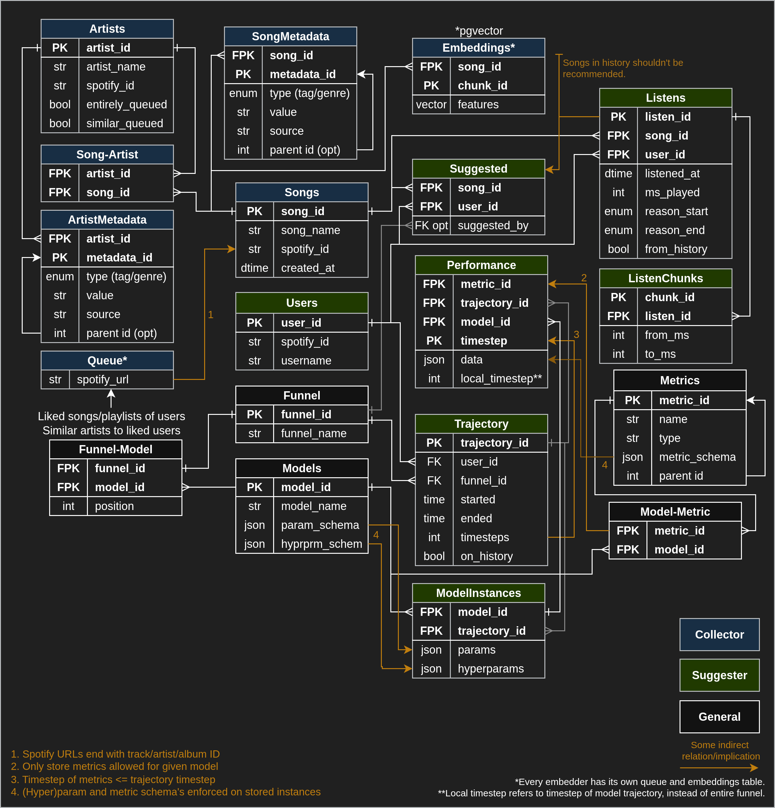

# Suggest: An Embedding and RL-Based Music Recommendation System
The project is set up into 3 modules:
1. **The collecter** constantly downloads and embeds new music, and collects metadata on those tags and artists;
    - The embedders currently used are [JukeMIR](https://github.com/p-lambda/jukemir) and [Auditus](https://github.com/CarloLepelaars/auditus).
2. **The suggester** is the core of the system, running models on the embedded songs in the DB;
    - At the moment, the only supported model is Ridge regression + UCB.
3. **The validator** *will contain* a collection of visualizations of model behavior and performance.

<!--  -->

## DB Schema

## File/Folder structure:
- **docker/** contains the compose config and individual Dockerfiles;
- **src/ai_models/** contains the models for use in the suggester module;
- **src/metrics/** contains the metrics for said models.

